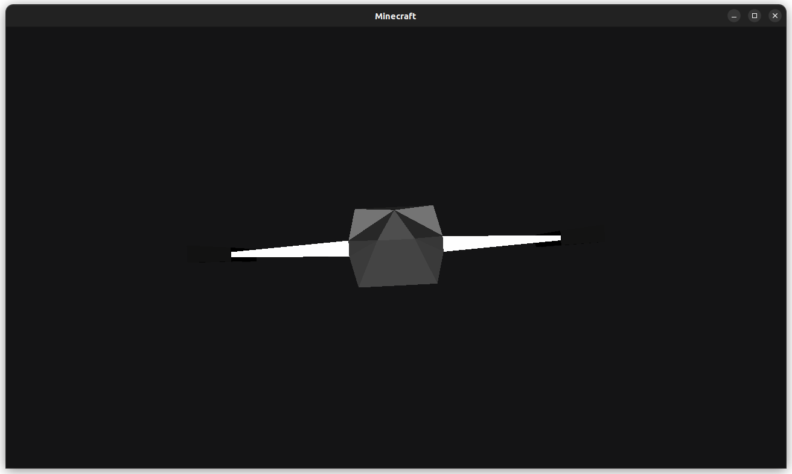
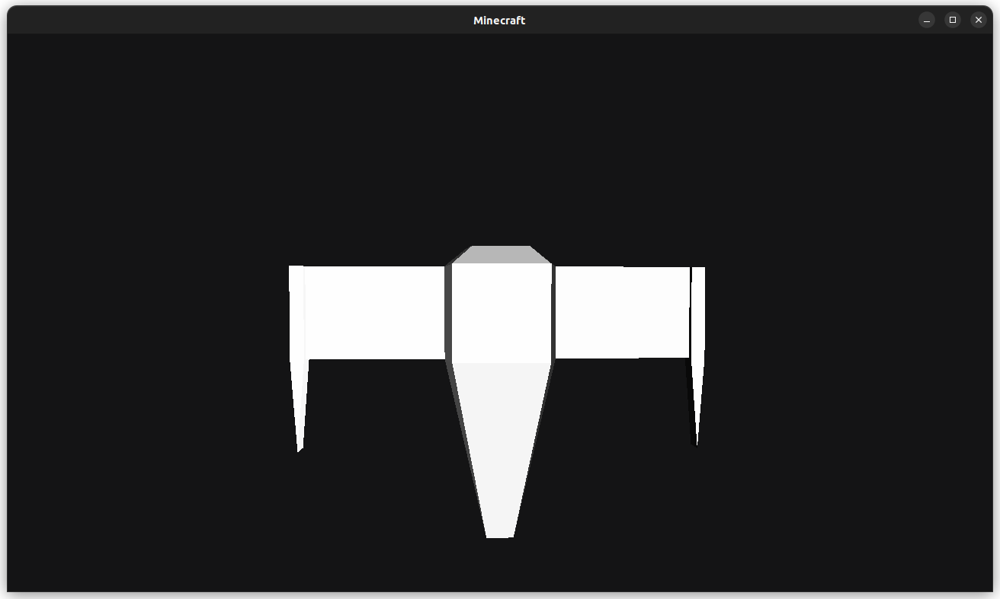
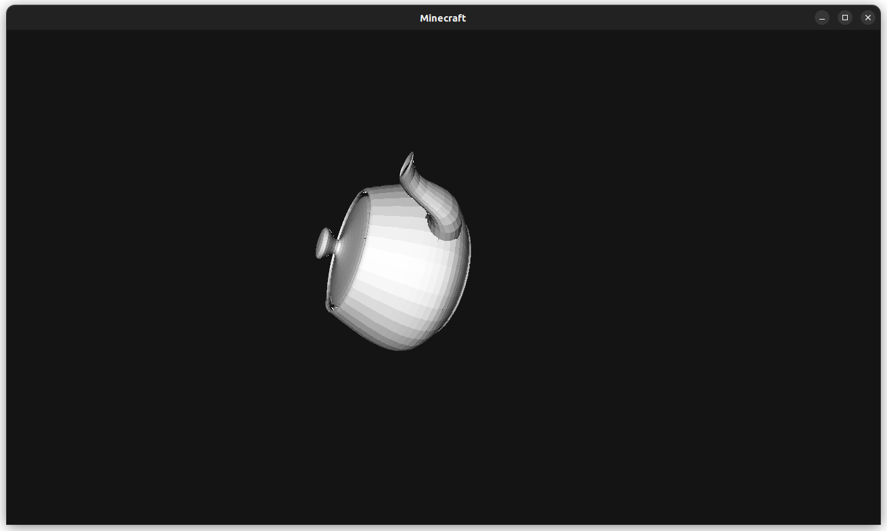
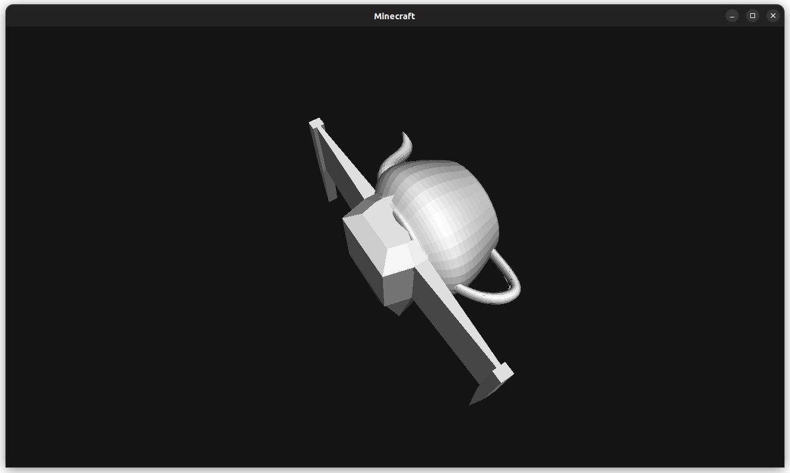

# Minecraft

Minecraft clone written in golang highly inspired from [Javidx9](https://github.com/OneLoneCoder)'s project [Engine3D](https://github.com/OneLoneCoder/Javidx9/tree/master/ConsoleGameEngine/BiggerProjects/Engine3D).

## Screenshots

